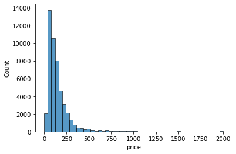
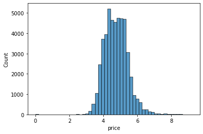
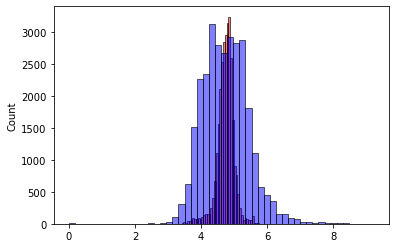
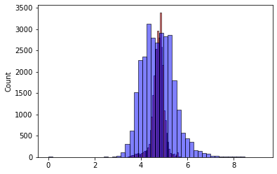

```python
import numpy as np
import pandas as pd
import matplotlib.pyplot as plt
import seaborn as sns
```

## Preparing the Data


```python
df=pd.read_csv("E:\machine learning\HomeWork2\AB_NYC_2019.csv")
df.head()
```


<div>
<style scoped>
    .dataframe tbody tr th:only-of-type {
        vertical-align: middle;
    }

    .dataframe tbody tr th {
        vertical-align: top;
    }

    .dataframe thead th {
        text-align: right;
    }
</style>
<table border="1" class="dataframe">
  <thead>
    <tr style="text-align: right;">
      <th></th>
      <th>id</th>
      <th>name</th>
      <th>host_id</th>
      <th>host_name</th>
      <th>neighbourhood_group</th>
      <th>neighbourhood</th>
      <th>latitude</th>
      <th>longitude</th>
      <th>room_type</th>
      <th>price</th>
      <th>minimum_nights</th>
      <th>number_of_reviews</th>
      <th>last_review</th>
      <th>reviews_per_month</th>
      <th>calculated_host_listings_count</th>
      <th>availability_365</th>
    </tr>
  </thead>
  <tbody>
    <tr>
      <th>0</th>
      <td>2539</td>
      <td>Clean &amp; quiet apt home by the park</td>
      <td>2787</td>
      <td>John</td>
      <td>Brooklyn</td>
      <td>Kensington</td>
      <td>40.64749</td>
      <td>-73.97237</td>
      <td>Private room</td>
      <td>149</td>
      <td>1</td>
      <td>9</td>
      <td>2018-10-19</td>
      <td>0.21</td>
      <td>6</td>
      <td>365</td>
    </tr>
    <tr>
      <th>1</th>
      <td>2595</td>
      <td>Skylit Midtown Castle</td>
      <td>2845</td>
      <td>Jennifer</td>
      <td>Manhattan</td>
      <td>Midtown</td>
      <td>40.75362</td>
      <td>-73.98377</td>
      <td>Entire home/apt</td>
      <td>225</td>
      <td>1</td>
      <td>45</td>
      <td>2019-05-21</td>
      <td>0.38</td>
      <td>2</td>
      <td>355</td>
    </tr>
    <tr>
      <th>2</th>
      <td>3647</td>
      <td>THE VILLAGE OF HARLEM....NEW YORK !</td>
      <td>4632</td>
      <td>Elisabeth</td>
      <td>Manhattan</td>
      <td>Harlem</td>
      <td>40.80902</td>
      <td>-73.94190</td>
      <td>Private room</td>
      <td>150</td>
      <td>3</td>
      <td>0</td>
      <td>NaN</td>
      <td>NaN</td>
      <td>1</td>
      <td>365</td>
    </tr>
    <tr>
      <th>3</th>
      <td>3831</td>
      <td>Cozy Entire Floor of Brownstone</td>
      <td>4869</td>
      <td>LisaRoxanne</td>
      <td>Brooklyn</td>
      <td>Clinton Hill</td>
      <td>40.68514</td>
      <td>-73.95976</td>
      <td>Entire home/apt</td>
      <td>89</td>
      <td>1</td>
      <td>270</td>
      <td>2019-07-05</td>
      <td>4.64</td>
      <td>1</td>
      <td>194</td>
    </tr>
    <tr>
      <th>4</th>
      <td>5022</td>
      <td>Entire Apt: Spacious Studio/Loft by central park</td>
      <td>7192</td>
      <td>Laura</td>
      <td>Manhattan</td>
      <td>East Harlem</td>
      <td>40.79851</td>
      <td>-73.94399</td>
      <td>Entire home/apt</td>
      <td>80</td>
      <td>10</td>
      <td>9</td>
      <td>2018-11-19</td>
      <td>0.10</td>
      <td>1</td>
      <td>0</td>
    </tr>
  </tbody>
</table>
</div>


The Data looks clean and uniform

# EDA

Understanding Our Data


```python
for col in df.columns:
    print(col)
    print(df[col].unique()[:5])
    print(df[col].nunique())
    print()
```

    id
    [2539 2595 3647 3831 5022]
    48895
    
    name
    ['Clean & quiet apt home by the park' 'Skylit Midtown Castle'
     'THE VILLAGE OF HARLEM....NEW YORK !' 'Cozy Entire Floor of Brownstone'
     'Entire Apt: Spacious Studio/Loft by central park']
    47905
    
    host_id
    [2787 2845 4632 4869 7192]
    37457
    
    host_name
    ['John' 'Jennifer' 'Elisabeth' 'LisaRoxanne' 'Laura']
    11452
    
    neighbourhood_group
    ['Brooklyn' 'Manhattan' 'Queens' 'Staten Island' 'Bronx']
    5
    
    neighbourhood
    ['Kensington' 'Midtown' 'Harlem' 'Clinton Hill' 'East Harlem']
    221
    
    latitude
    [40.64749 40.75362 40.80902 40.68514 40.79851]
    19048
    
    longitude
    [-73.97237 -73.98377 -73.9419  -73.95976 -73.94399]
    14718
    
    room_type
    ['Private room' 'Entire home/apt' 'Shared room']
    3
    
    price
    [149 225 150  89  80]
    674
    
    minimum_nights
    [ 1  3 10 45  2]
    109
    
    number_of_reviews
    [  9  45   0 270  74]
    394
    
    last_review
    ['2018-10-19' '2019-05-21' nan '2019-07-05' '2018-11-19']
    1764
    
    reviews_per_month
    [0.21 0.38  nan 4.64 0.1 ]
    937
    
    calculated_host_listings_count
    [6 2 1 4 3]
    47
    
    availability_365
    [365 355 194   0 129]
    366
    
    


```python
%matplotlib inline
sns.histplot(df.price, bins=50)
```


    <AxesSubplot:xlabel='price', ylabel='Count'>


    

    


```python
sns.histplot(df.price[df.price<=2000], bins=50)
```


    <AxesSubplot:xlabel='price', ylabel='Count'>


    

    


The price column has a long tail.
So we need to make it better because usually machine learning models doesn't do well with a long tail data.


```python
price_logs = np.log1p(df.price)
```


```python
sns.histplot(price_logs, bins=50)
```


    <AxesSubplot:xlabel='price', ylabel='Count'>


    

    


Now, It has an inverse 'U' shape and that's good for our model.

## Main Features of Our Model 


```python
base=['latitude',
'longitude',
'minimum_nights',
'number_of_reviews',
'reviews_per_month',
'calculated_host_listings_count',
'availability_365']
features=['latitude','longitude','minimum_nights','number_of_reviews','reviews_per_month',
'calculated_host_listings_count','availability_365']
df
```


<div>
<style scoped>
    .dataframe tbody tr th:only-of-type {
        vertical-align: middle;
    }

    .dataframe tbody tr th {
        vertical-align: top;
    }

    .dataframe thead th {
        text-align: right;
    }
</style>
<table border="1" class="dataframe">
  <thead>
    <tr style="text-align: right;">
      <th></th>
      <th>id</th>
      <th>name</th>
      <th>host_id</th>
      <th>host_name</th>
      <th>neighbourhood_group</th>
      <th>neighbourhood</th>
      <th>latitude</th>
      <th>longitude</th>
      <th>room_type</th>
      <th>price</th>
      <th>minimum_nights</th>
      <th>number_of_reviews</th>
      <th>last_review</th>
      <th>reviews_per_month</th>
      <th>calculated_host_listings_count</th>
      <th>availability_365</th>
    </tr>
  </thead>
  <tbody>
    <tr>
      <th>0</th>
      <td>2539</td>
      <td>Clean &amp; quiet apt home by the park</td>
      <td>2787</td>
      <td>John</td>
      <td>Brooklyn</td>
      <td>Kensington</td>
      <td>40.64749</td>
      <td>-73.97237</td>
      <td>Private room</td>
      <td>149</td>
      <td>1</td>
      <td>9</td>
      <td>2018-10-19</td>
      <td>0.21</td>
      <td>6</td>
      <td>365</td>
    </tr>
    <tr>
      <th>1</th>
      <td>2595</td>
      <td>Skylit Midtown Castle</td>
      <td>2845</td>
      <td>Jennifer</td>
      <td>Manhattan</td>
      <td>Midtown</td>
      <td>40.75362</td>
      <td>-73.98377</td>
      <td>Entire home/apt</td>
      <td>225</td>
      <td>1</td>
      <td>45</td>
      <td>2019-05-21</td>
      <td>0.38</td>
      <td>2</td>
      <td>355</td>
    </tr>
    <tr>
      <th>2</th>
      <td>3647</td>
      <td>THE VILLAGE OF HARLEM....NEW YORK !</td>
      <td>4632</td>
      <td>Elisabeth</td>
      <td>Manhattan</td>
      <td>Harlem</td>
      <td>40.80902</td>
      <td>-73.94190</td>
      <td>Private room</td>
      <td>150</td>
      <td>3</td>
      <td>0</td>
      <td>NaN</td>
      <td>NaN</td>
      <td>1</td>
      <td>365</td>
    </tr>
    <tr>
      <th>3</th>
      <td>3831</td>
      <td>Cozy Entire Floor of Brownstone</td>
      <td>4869</td>
      <td>LisaRoxanne</td>
      <td>Brooklyn</td>
      <td>Clinton Hill</td>
      <td>40.68514</td>
      <td>-73.95976</td>
      <td>Entire home/apt</td>
      <td>89</td>
      <td>1</td>
      <td>270</td>
      <td>2019-07-05</td>
      <td>4.64</td>
      <td>1</td>
      <td>194</td>
    </tr>
    <tr>
      <th>4</th>
      <td>5022</td>
      <td>Entire Apt: Spacious Studio/Loft by central park</td>
      <td>7192</td>
      <td>Laura</td>
      <td>Manhattan</td>
      <td>East Harlem</td>
      <td>40.79851</td>
      <td>-73.94399</td>
      <td>Entire home/apt</td>
      <td>80</td>
      <td>10</td>
      <td>9</td>
      <td>2018-11-19</td>
      <td>0.10</td>
      <td>1</td>
      <td>0</td>
    </tr>
    <tr>
      <th>...</th>
      <td>...</td>
      <td>...</td>
      <td>...</td>
      <td>...</td>
      <td>...</td>
      <td>...</td>
      <td>...</td>
      <td>...</td>
      <td>...</td>
      <td>...</td>
      <td>...</td>
      <td>...</td>
      <td>...</td>
      <td>...</td>
      <td>...</td>
      <td>...</td>
    </tr>
    <tr>
      <th>48890</th>
      <td>36484665</td>
      <td>Charming one bedroom - newly renovated rowhouse</td>
      <td>8232441</td>
      <td>Sabrina</td>
      <td>Brooklyn</td>
      <td>Bedford-Stuyvesant</td>
      <td>40.67853</td>
      <td>-73.94995</td>
      <td>Private room</td>
      <td>70</td>
      <td>2</td>
      <td>0</td>
      <td>NaN</td>
      <td>NaN</td>
      <td>2</td>
      <td>9</td>
    </tr>
    <tr>
      <th>48891</th>
      <td>36485057</td>
      <td>Affordable room in Bushwick/East Williamsburg</td>
      <td>6570630</td>
      <td>Marisol</td>
      <td>Brooklyn</td>
      <td>Bushwick</td>
      <td>40.70184</td>
      <td>-73.93317</td>
      <td>Private room</td>
      <td>40</td>
      <td>4</td>
      <td>0</td>
      <td>NaN</td>
      <td>NaN</td>
      <td>2</td>
      <td>36</td>
    </tr>
    <tr>
      <th>48892</th>
      <td>36485431</td>
      <td>Sunny Studio at Historical Neighborhood</td>
      <td>23492952</td>
      <td>Ilgar &amp; Aysel</td>
      <td>Manhattan</td>
      <td>Harlem</td>
      <td>40.81475</td>
      <td>-73.94867</td>
      <td>Entire home/apt</td>
      <td>115</td>
      <td>10</td>
      <td>0</td>
      <td>NaN</td>
      <td>NaN</td>
      <td>1</td>
      <td>27</td>
    </tr>
    <tr>
      <th>48893</th>
      <td>36485609</td>
      <td>43rd St. Time Square-cozy single bed</td>
      <td>30985759</td>
      <td>Taz</td>
      <td>Manhattan</td>
      <td>Hell's Kitchen</td>
      <td>40.75751</td>
      <td>-73.99112</td>
      <td>Shared room</td>
      <td>55</td>
      <td>1</td>
      <td>0</td>
      <td>NaN</td>
      <td>NaN</td>
      <td>6</td>
      <td>2</td>
    </tr>
    <tr>
      <th>48894</th>
      <td>36487245</td>
      <td>Trendy duplex in the very heart of Hell's Kitchen</td>
      <td>68119814</td>
      <td>Christophe</td>
      <td>Manhattan</td>
      <td>Hell's Kitchen</td>
      <td>40.76404</td>
      <td>-73.98933</td>
      <td>Private room</td>
      <td>90</td>
      <td>7</td>
      <td>0</td>
      <td>NaN</td>
      <td>NaN</td>
      <td>1</td>
      <td>23</td>
    </tr>
  </tbody>
</table>
<p>48895 rows × 16 columns</p>
</div>


# Question 1
### Missing Values


```python
df.isnull().sum()
```


    id                                    0
    name                                 16
    host_id                               0
    host_name                            21
    neighbourhood_group                   0
    neighbourhood                         0
    latitude                              0
    longitude                             0
    room_type                             0
    price                                 0
    minimum_nights                        0
    number_of_reviews                     0
    last_review                       10052
    reviews_per_month                 10052
    calculated_host_listings_count        0
    availability_365                      0
    dtype: int64


```python
df.reviews_per_month.isnull().sum()
```


    10052


# Question 2
### median of minimum_nights


```python
df.minimum_nights.describe()
```


    count    48895.000000
    mean         7.029962
    std         20.510550
    min          1.000000
    25%          1.000000
    50%          3.000000
    75%          5.000000
    max       1250.000000
    Name: minimum_nights, dtype: float64


```python
df.minimum_nights.median()
```


    3.0


## Splitting The Data


```python
n = len(df)

n_val = int(n * 0.2)
n_test = int(n * 0.2)
n_train = n - n_val - n_test
```


```python
n, n_train,n_val, n_test

```


    (48895, 29337, 9779, 9779)


```python
idx = np.arange(n)
```


```python
np.random.seed(42)
np.random.shuffle(idx)
```


```python
df_train = df.iloc[idx[:n_train]]
df_val   = df.iloc[idx[n_train:n_train+n_val]]
df_test  = df.iloc[idx[n_train+n_val:]]
```


```python
df_train.head()
```


<div>
<style scoped>
    .dataframe tbody tr th:only-of-type {
        vertical-align: middle;
    }

    .dataframe tbody tr th {
        vertical-align: top;
    }

    .dataframe thead th {
        text-align: right;
    }
</style>
<table border="1" class="dataframe">
  <thead>
    <tr style="text-align: right;">
      <th></th>
      <th>id</th>
      <th>name</th>
      <th>host_id</th>
      <th>host_name</th>
      <th>neighbourhood_group</th>
      <th>neighbourhood</th>
      <th>latitude</th>
      <th>longitude</th>
      <th>room_type</th>
      <th>price</th>
      <th>minimum_nights</th>
      <th>number_of_reviews</th>
      <th>last_review</th>
      <th>reviews_per_month</th>
      <th>calculated_host_listings_count</th>
      <th>availability_365</th>
    </tr>
  </thead>
  <tbody>
    <tr>
      <th>879</th>
      <td>317905</td>
      <td>Come and go as  you please in BKLN!</td>
      <td>1631733</td>
      <td>Jane</td>
      <td>Brooklyn</td>
      <td>Kensington</td>
      <td>40.64354</td>
      <td>-73.97777</td>
      <td>Entire home/apt</td>
      <td>89</td>
      <td>3</td>
      <td>62</td>
      <td>2019-01-02</td>
      <td>0.71</td>
      <td>1</td>
      <td>189</td>
    </tr>
    <tr>
      <th>44383</th>
      <td>34205267</td>
      <td>Spacious, sunny room in Queens/Brooklyn</td>
      <td>913940</td>
      <td>Giancarlo</td>
      <td>Queens</td>
      <td>Ridgewood</td>
      <td>40.70666</td>
      <td>-73.90779</td>
      <td>Private room</td>
      <td>30</td>
      <td>21</td>
      <td>0</td>
      <td>NaN</td>
      <td>NaN</td>
      <td>1</td>
      <td>73</td>
    </tr>
    <tr>
      <th>15394</th>
      <td>12342297</td>
      <td>Private bedroom in high-ceiling 4BR apartment!</td>
      <td>19953913</td>
      <td>Alejandro</td>
      <td>Manhattan</td>
      <td>Hell's Kitchen</td>
      <td>40.76116</td>
      <td>-73.99016</td>
      <td>Private room</td>
      <td>120</td>
      <td>2</td>
      <td>17</td>
      <td>2017-04-28</td>
      <td>0.43</td>
      <td>1</td>
      <td>0</td>
    </tr>
    <tr>
      <th>43230</th>
      <td>33527778</td>
      <td>Sonder | Stock Exchange | Stunning 3BR + Kitchen</td>
      <td>219517861</td>
      <td>Sonder (NYC)</td>
      <td>Manhattan</td>
      <td>Financial District</td>
      <td>40.70763</td>
      <td>-74.01050</td>
      <td>Entire home/apt</td>
      <td>470</td>
      <td>2</td>
      <td>5</td>
      <td>2019-06-02</td>
      <td>1.88</td>
      <td>327</td>
      <td>272</td>
    </tr>
    <tr>
      <th>16332</th>
      <td>13136376</td>
      <td>Spacious 2 Bedroom with Balcony</td>
      <td>16110448</td>
      <td>Gingie</td>
      <td>Manhattan</td>
      <td>East Harlem</td>
      <td>40.79658</td>
      <td>-73.93287</td>
      <td>Entire home/apt</td>
      <td>199</td>
      <td>2</td>
      <td>30</td>
      <td>2019-06-03</td>
      <td>0.80</td>
      <td>1</td>
      <td>30</td>
    </tr>
  </tbody>
</table>
</div>


```python
df_train = df_train.reset_index(drop=True)
df_val   = df_val.reset_index(drop=True)
df_test  = df_test.reset_index(drop=True)
```


```python
y_train = np.log1p(df_train.price.values)
y_val   = np.log1p(df_val.price.values)
y_test  = np.log1p(df_test.price.values)
```


```python
del df_train['price']
del df_val['price']
del df_test['price']
```


```python
df_train_fill0=df_train.copy()
df_train_fill_mean=df_train.copy()
```


```python
original_mean = df_train['reviews_per_month'].mean()
original_mean
```


    1.3685492094777056


```python
df_train_fill0['reviews_per_month']=df_train_fill0['reviews_per_month'].fillna(0)
mean0 = df_train_fill0['reviews_per_month'].mean()
mean0
```


    1.0887469748099727


```python
df_train_fill_mean['reviews_per_month'] = df_train_fill_mean['reviews_per_month'].fillna(original_mean)
mean_fill_mean = df_train_fill_mean['reviews_per_month'].mean()
mean_fill_mean
```


    1.3685492094777751


```python
X_train_0 = df_train_fill0[features].values
X_train_mean=df_train_fill_mean[features].values
```

### Training The Model using Linear Regression Model Without Regularization


```python
def train_linear_regression(X, y):
    ones = np.ones(X.shape[0])
    X = np.column_stack([ones, X])

    XTX = X.T.dot(X)
    XTX_inv = np.linalg.inv(XTX)
    w_full = XTX_inv.dot(X.T).dot(y)
    
    return w_full[0], w_full[1:]
```


```python
w0_0,w_0=train_linear_regression(X_train_0,y_train)
y_pred_0 = w0_0 + X_train_0.dot(w_0)
w0_0,w_0
```


    (-419.91265866086724,
     array([ 1.30676226e+00, -5.02167855e+00, -5.59803110e-04, -4.07634896e-04,
            -8.25470066e-03,  1.33371320e-03,  6.50203890e-04]))


Above are the results for filling with 0s


```python
w0_mean,w_mean=train_linear_regression(X_train_mean,y_train)
y_pred_mean=w0_mean+X_train_mean.dot(w_mean)
w0_mean,w_mean
```


    (-423.5393082023219,
     array([ 1.31148321e+00, -5.06799071e+00, -4.87741552e-04, -6.63849280e-04,
             5.34563274e-03,  1.32706019e-03,  6.38794182e-04]))


Above are the results for filling with mean value


```python
sns.histplot(y_pred_0, color='red', alpha=0.5, bins=50)
sns.histplot(y_train, color='blue', alpha=0.5, bins=50)
```


    <AxesSubplot:ylabel='Count'>


    

    


```python
sns.histplot(y_pred_mean, color='red', alpha=0.5, bins=50)
sns.histplot(y_train, color='blue', alpha=0.5, bins=50)
```


    <AxesSubplot:ylabel='Count'>


    

    


We still need to do some enhancment

### Evaluation using RMSE on Training set


```python
def rmse(y, y_pred):
    se = (y - y_pred) ** 2
    mse = se.mean()
    return np.sqrt(mse)
```


```python
r0=rmse(y_train, y_pred_0)
rmean=rmse(y_train, y_pred_mean)
print(round(r0,2))
print(round(rmean,2))
r0
```

    0.64
    0.64
    


    0.6428860484860401


## Validating using Val Set


```python
def prepare_X(df):
    df = df.copy()    
    df_num = df[features]
    df_num = df_num.fillna(0)
    X = df_num.values
    return X
```


```python
X_train = prepare_X(df_train)
w0, w = train_linear_regression(X_train, y_train)

X_val = prepare_X(df_val)
y_pred = w0 + X_val.dot(w)
rr0=rmse(y_val, y_pred)
```


```python
y_pred_mean1=w0_mean+X_val.dot(w_mean)
rrmean=rmse(y_val, y_pred_mean1)
```


```python
print(round(rr0,2))
print(round(rrmean,2))
```

    0.64
    0.64
    

The RMSE Valuse are approx. the same.

# Question 4
### Training our model using Linear Regression with Reqularization & Filling with 0


```python
def train_linear_regression_reg(X, y, r=0.001):
    ones = np.ones(X.shape[0])
    X = np.column_stack([ones, X])

    XTX = X.T.dot(X)
    XTX = XTX + r * np.eye(XTX.shape[0])

    XTX_inv = np.linalg.inv(XTX)
    w_full = XTX_inv.dot(X.T).dot(y)
    
    return w_full[0], w_full[1:]
```


```python
for r in [0, 0.000001, 0.0001, 0.001, 0.01, 0.1, 1, 5, 10]:
    X_train = prepare_X(df_train)
    w0, w = train_linear_regression_reg(X_train, y_train, r=r)

    X_val = prepare_X(df_val)
    y_pred = w0 + X_val.dot(w)
    score = round(rmse(y_val, y_pred),2)
    print(' r = {}, w0 = {}, RMSE value = {}'.format(r,w0,score))
    
```

     r = 0, w0 = -419.91265866086724, RMSE value = 0.64
     r = 1e-06, w0 = -419.86271584310543, RMSE value = 0.64
     r = 0.0001, w0 = -414.9764926433289, RMSE value = 0.64
     r = 0.001, w0 = -375.27365274892543, RMSE value = 0.64
     r = 0.01, w0 = -191.7838405478213, RMSE value = 0.66
     r = 0.1, w0 = -32.562560550033176, RMSE value = 0.68
     r = 1, w0 = -3.499216833574792, RMSE value = 0.68
     r = 5, w0 = -0.7033623186161135, RMSE value = 0.68
     r = 10, w0 = -0.35127676047352, RMSE value = 0.68
    

r=0 is the best because there is no similar columns so we don't need Reqularization

# Question 5
### Trying different seed values


```python
scores=[]
for s in [0, 1, 2, 3, 4, 5, 6, 7, 8, 9]:    
    idx = np.arange(n)
    np.random.seed(s)
    np.random.shuffle(idx)

    df_train = df.iloc[idx[:n_train]]
    df_val   = df.iloc[idx[n_train:n_train+n_val]]
    df_test  = df.iloc[idx[n_train+n_val:]]
    
    df_train = df_train.reset_index(drop=True)
    df_val = df_val.reset_index(drop=True)
    df_test = df_test.reset_index(drop=True)


    y_train = np.log1p(df_train.price.values)
    y_val = np.log1p(df_val.price.values)
    y_test = np.log1p(df_test.price.values)


    del df_train['price']
    del df_val['price']
    del df_test['price']
    
    X_train = prepare_X(df_train)
    w0, w = train_linear_regression(X_train, y_train)
    X_val = prepare_X(df_val)
    y_pred = w0 + X_val.dot(w)
    scores.append(rmse(y_val, y_pred))
    
print (scores)

```

    [0.6549779961545402, 0.6462523685884172, 0.6476558177554858, 0.6375145069192687, 0.6445809082722467, 0.630580999658293, 0.6297851917613978, 0.6506184266611098, 0.6489780353489043, 0.6437565168224396]
    


```python
std=np.std(scores)
std.round(3)
```


    0.008


# Question 6
### Complete Model using seed 9 and r=0.001 and compining train&validating set


```python
idx = np.arange(n)
np.random.seed(9)
np.random.shuffle(idx)


df_full_train = pd.concat([df_train, df_val])
y_full_train = np.concatenate([y_train, y_val])

df_full_train = df_full_train.reset_index(drop=True)
X_full_train = prepare_X(df_full_train)


w0, w = train_linear_regression_reg(X_full_train, y_full_train, r=0.001)


X_test = prepare_X(df_test)
y_pred = w0 + X_test.dot(w)
resultant = rmse(y_test, y_pred)
resultant

```


    0.6452771348581781


## Simple Feature Engineering (Adding Categorical Variables)


```python
def prepare_new_X(df):
    
    df = df.copy()
    features1= base.copy()
    
    for v in ['Private room', 'Entire home/apt', 'Shared room']:
        df['room_type_%s' % v] = (df.room_type == v).astype(int)
        features1.append('room_type_%s' % v)
    
    df_num = df[features1]
    df_num = df_num.fillna(0)
    X = df_num.values
    return X
```


```python
X_train_new = prepare_new_X(df_train)
w0, w = train_linear_regression_reg(X_train_new, y_train, r=0.001)

X_val_new = prepare_new_X(df_val)
y_pred = w0 + X_val_new.dot(w)
rmse(y_val, y_pred)
```


    0.5081700620844719


### So here is the final model after adding Categorical Variables and using Linear_Regression_Regilarization

RMSE value is 0.5 with Categorical Variables.<br>
RMSE value is 0.64 without Categorical Variables  


```python
X_train_new1 = prepare_new_X(df_full_train)
w0, w = train_linear_regression_reg(X_train_new1, y_full_train, r=0.001)

X_test_new = prepare_new_X(df_test)
y_pred = w0 + X_test_new.dot(w)
rmse(y_test, y_pred)
```


    0.5069276592721422


### This is the final model after training 80% of the data

# Using Our Model


```python
house = df_test.iloc[20].to_dict()
house
```


    {'id': 33635511,
     'name': 'Hamilton Heights Home Away from Home! (30-Day Min)',
     'host_id': 23777742,
     'host_name': 'Eliot',
     'neighbourhood_group': 'Manhattan',
     'neighbourhood': 'Harlem',
     'latitude': 40.82479,
     'longitude': -73.94218,
     'room_type': 'Entire home/apt',
     'minimum_nights': 30,
     'number_of_reviews': 0,
     'last_review': nan,
     'reviews_per_month': nan,
     'calculated_host_listings_count': 1,
     'availability_365': 242}


```python
df_small = pd.DataFrame([house])
df_small
```


<div>
<style scoped>
    .dataframe tbody tr th:only-of-type {
        vertical-align: middle;
    }

    .dataframe tbody tr th {
        vertical-align: top;
    }

    .dataframe thead th {
        text-align: right;
    }
</style>
<table border="1" class="dataframe">
  <thead>
    <tr style="text-align: right;">
      <th></th>
      <th>id</th>
      <th>name</th>
      <th>host_id</th>
      <th>host_name</th>
      <th>neighbourhood_group</th>
      <th>neighbourhood</th>
      <th>latitude</th>
      <th>longitude</th>
      <th>room_type</th>
      <th>minimum_nights</th>
      <th>number_of_reviews</th>
      <th>last_review</th>
      <th>reviews_per_month</th>
      <th>calculated_host_listings_count</th>
      <th>availability_365</th>
    </tr>
  </thead>
  <tbody>
    <tr>
      <th>0</th>
      <td>33635511</td>
      <td>Hamilton Heights Home Away from Home! (30-Day ...</td>
      <td>23777742</td>
      <td>Eliot</td>
      <td>Manhattan</td>
      <td>Harlem</td>
      <td>40.82479</td>
      <td>-73.94218</td>
      <td>Entire home/apt</td>
      <td>30</td>
      <td>0</td>
      <td>NaN</td>
      <td>NaN</td>
      <td>1</td>
      <td>242</td>
    </tr>
  </tbody>
</table>
</div>


That is like someone wanna know the price of a house with certain features and it comes to us in (dictionary format) now we will use our model to predict the price


```python
X_small = prepare_new_X(df_small)
y_pred = w0 + X_small.dot(w)
y_pred = y_pred[0]
y_pred
```


    5.2746449795340595


```python
y_test[20]
```


    4.836281906951478


So the difference is about 400$.


```python

```
